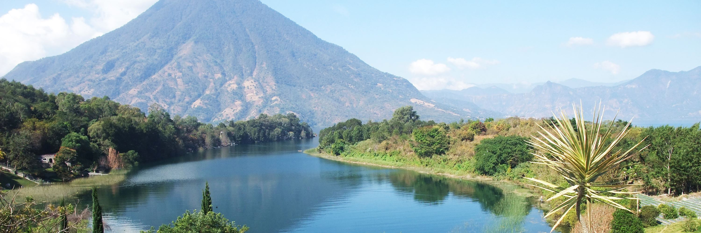
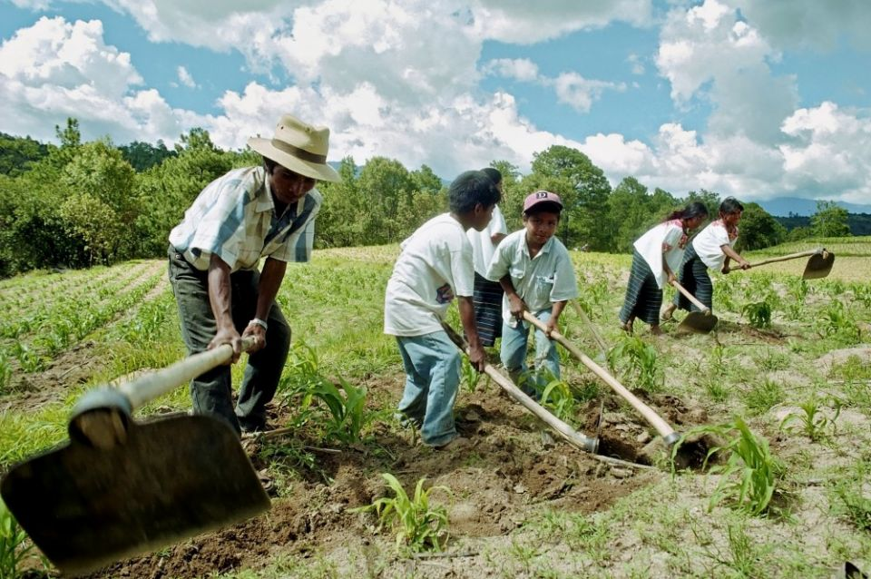
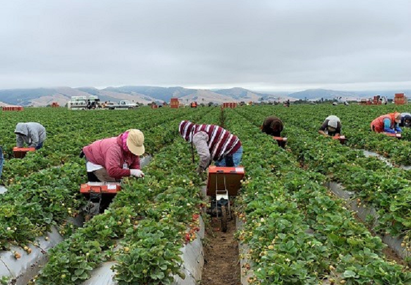
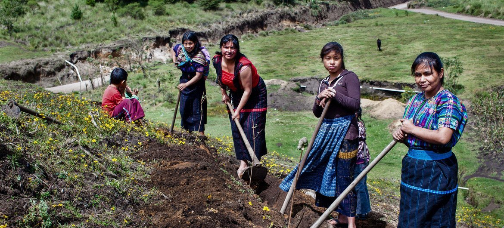
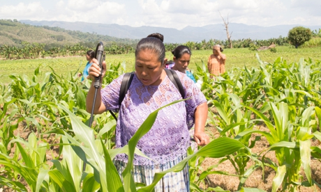
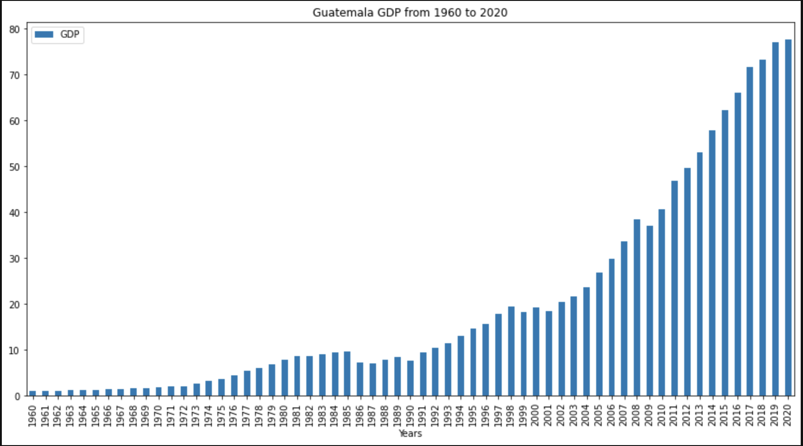
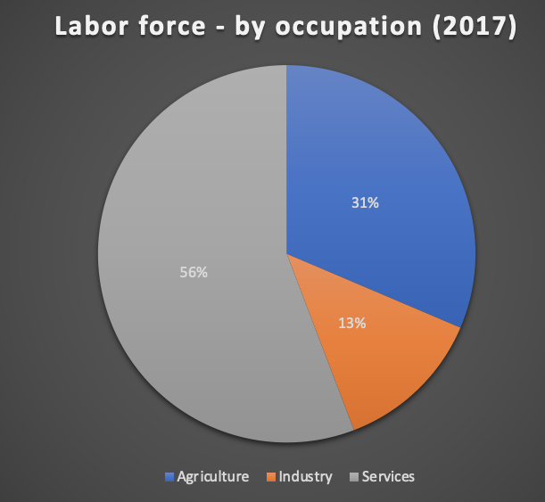
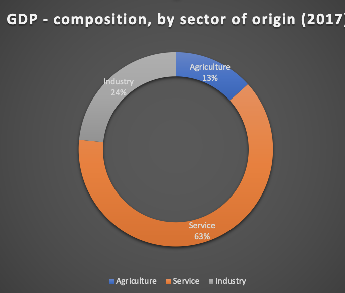

<!-- vscode-markdown-toc -->
* 1. [by Tyler Hubbard, Erin Rahman, Wilson Quizhpi](#byTylerHubbardErinRahmanWilsonQuizhpi)
* 2. [GDP](#GDP)
* 3. [Agricultural products](#Agriculturalproducts)
	* 3.1. [Labor force - by occupation](#Laborforce-byoccupation)

<!-- vscode-markdown-toc-config
	numbering=true
	autoSave=true
	/vscode-markdown-toc-config -->
<!-- /vscode-markdown-toc -->
# Guatemala infrastructure and education problem in the agriculture sector

##  1. by Tyler Hubbard, Erin Rahman, Wilson Quizhpi

    
         

</head>
<body>
    

        

        

        

        
##  2. GDP
$77.6 billion USD (2020)
  

  
  ###  3.1. Labor force - by occupation      
 

### 3.2. Agriculture: 31.4%
  
 

   

         
##  3. Agricultural products

## Tables
Products | Product Category | Export in Billions
---| ---| ---|
Bananas	 | Vegetable Products | 1.15
Nutmeg, mace and cardamons | Vegetable Products | 1.14
Coffee |Vegetable Products | 0.684
Raw Sugar| Food stuffs | 0.598
Palm Oil| Animal and Vegetable Bi-Products| 0.466
Ferroalloys	 | Metals | 0.318
Knit Sweaters | Textiles	 | 0.292
Knit Men's Shirts | Textiles | 0.274
Packaged Medicaments | Chemical Products |0.258
Knit Women's Shirts|Textiles	 | 0.226
	                                        

