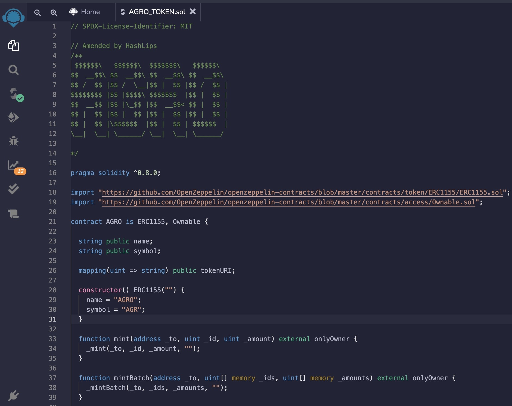
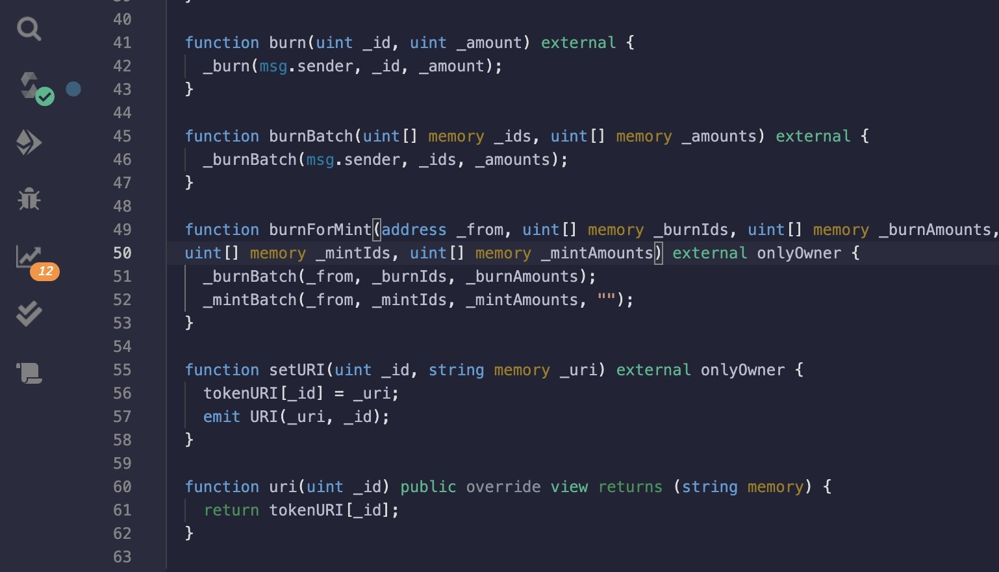

# Guatemala infrastructure and education problem in the agriculture sector
<!-- vscode-markdown-toc -->
* 1. [by Tyler Hubbard, Wilson Quizhpi](#byTylerHubbardErinRahmanWilsonQuizhpi)
* 2. [GDP](#GDP)
* 3. [Agricultural products](#Agriculturalproducts)
* 4. [Labor force - by occupation](#Laborforce-byoccupation)

      
##  2. GDP (GDP = C + I + G + (X-M))
$77.6 billion USD (2020)
  

  
  ###  3.1. Labor force - by occupation (31.4)     
 

### 3.2. Agriculture GDP (13.3%)
  
 

            
##  3. Agricultural products

## Tables
Products | Product Category | Export in Billions
---| ---| ---|
Bananas	 | Vegetable Products | 1.15
Nutmeg, mace and cardamons | Vegetable Products | 1.14
Coffee |Vegetable Products | 0.684
Raw Sugar| Food stuffs | 0.598
Palm Oil| Animal and Vegetable Bi-Products| 0.466
Ferroalloys	 | Metals | 0.318
Knit Sweaters | Textiles	 | 0.292
Knit Men's Shirts | Textiles | 0.274
Packaged Medicaments | Chemical Products |0.258
Knit Women's Shirts|Textiles	 | 0.226
	                                        
                                          
## Tables
ERC20 | ERC721 | ERC71155
---| ---| ---|
individual FT	 | individual NFT  | Combine FT & NFT
True decentralize|True decentralize | server Dependent
Gas Fees every deployment  |Gas Fees every deployment| Maximize Gas Fees

## GDP

## Agro Token
</head>
<body>
    

        

        

## Contract Deployment
</head>
<body>
    

        

        

## Piñata

