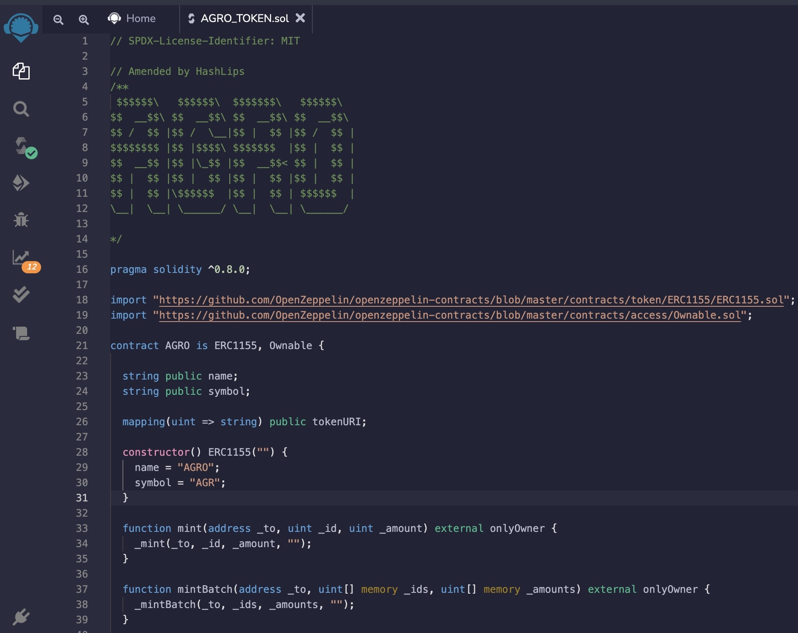
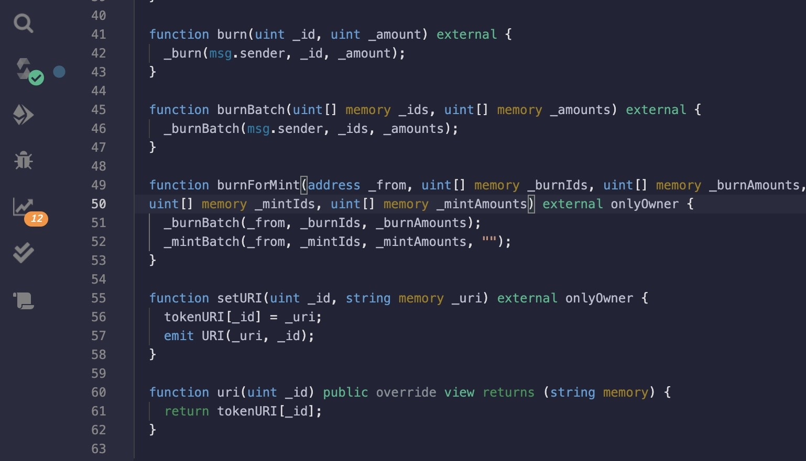
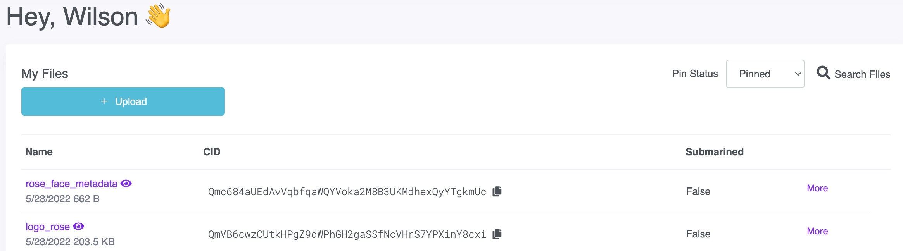

# UMN Fintech - Project 3 Group 2
## AGRO Token & Agro DAO

### We will be creating a DAO and token system to benefit the education of farmers globally. In our MVP we aim to implement a "learn to earn" model structure for users to better understand various aspects about farming and the different commodities related to farming, a DAO for farmers to make various governance decisions and engage in community outreach, and a token system (AGRO token) built to suit this ecosystem.

<!-- vscode-markdown-toc -->
* 1. [GDP](#GDP)
* 2. [Agricultural products](#Agriculturalproducts)
  * 2.1. [Labor force - by occupation](#Laborforce-byoccupation)

<!-- vscode-markdown-toc-config
	numbering=true
	autoSave=true
	/vscode-markdown-toc-config -->
<!-- /vscode-markdown-toc -->
## Guatemala infrastructure and the education problem in the agriculture sector
   
###  1. GDP
$77.6 billion USD (2020)
  

  
  ####  1.1. Labor force - by occupation      
 

#### 1.2. Agriculture: 31.4%
  
 

   

         
##  2. Agricultural products

## Tables
Products | Product Category | Export in Billions
---| ---| ---|
Bananas	 | Vegetable Products | 1.15
Nutmeg, mace and cardamons | Vegetable Products | 1.14
Coffee |Vegetable Products | 0.684
Raw Sugar| Food stuffs | 0.598
Palm Oil| Animal and Vegetable Bi-Products| 0.466
Ferroalloys	 | Metals | 0.318
Knit Sweaters | Textiles	 | 0.292
Knit Men's Shirts | Textiles | 0.274
Packaged Medicaments | Chemical Products |0.258
Knit Women's Shirts|Textiles	 | 0.226
	                                        
                                          
## Tables
ERC20 | ERC721 | ERC1155
---| ---| ---|
individual FT	 | individual NFT  | Combine FT & NFT
True decentralize|True decentralize | server Dependent
Gas Fees every deployment  |Gas Fees every deployment| Maximize Gas Fees

## GDP
GDP = C + I + G + (X-M)
## Agro Token
</head>
<body>
    

        

        

## AGRO Token Contract Deployment:

## Piñata

      
## AgroDAO Contract Deployment:

